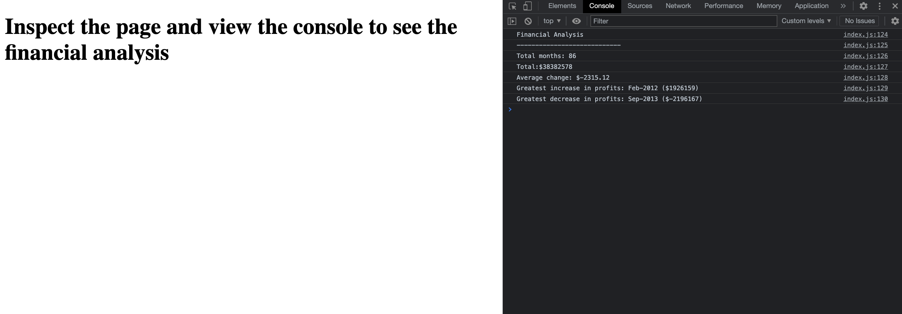

# Console-Finances – Financial Analysis
A JavaScript program that analyzes financial records and calculates various metrics. It can be viewed via this link: https://rararach-l.github.io/Console-Finances/

# Description
Given a dataset of financial records in the form of an array of arrays, this program calculates the following metrics using for loops:

* The total number of months included in the dataset
* The net total amount of profit or loss over the entire period
* The average of the changes in profit or loss over the entire period
* The greatest increase in profits (date and amount) over the entire period
* The greatest decrease in losses (date and amount) over the entire period

# Installation
To use this program, you will need to have a JavaScript runtime environment set up on your computer – for example, it can be viewed in page console of the chrome browser.

# Usage
To run the program, you will need to view it in the console, where the program will output the results of the financial analysis. The page should look like this one opened:

# Credits
This program was created following classes on front end development via trilogy eduction

# License
This program is released under the MIT License. See the LICENSE file for more information.
